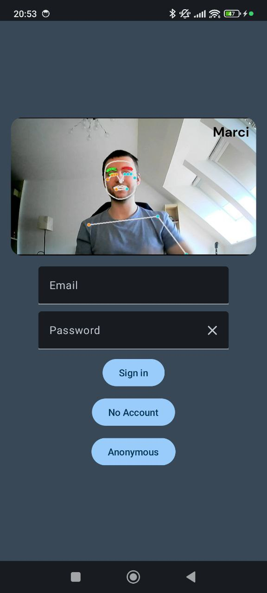
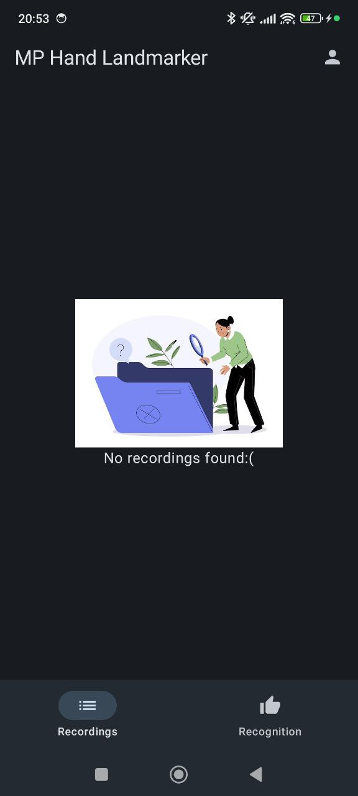
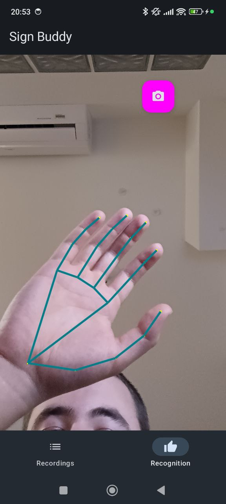
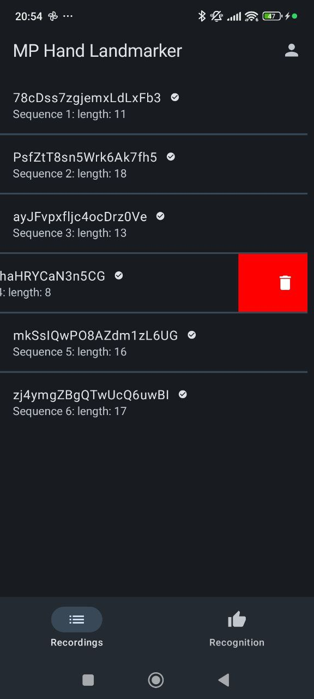

# Sign Buddy

## Bemutatás

Az alkalmazás jelnyelv fordításhoz gyűjt adatokat. Egy újszerű megközelítés a feladatra, hogy képek/videó helyett, póz approximációval először jellegzetes pontokat azonosítunk be a kézen, majd a modellek ebből tanulnak.
Google MediaPipe Hands modell segítségével ez a lépés elvégezhető android platformon is, majd egy megfelelő backend szolgáltatás össze is gyűjti az adatokat.

## Főbb funkciók

- Felhasználói authentikáció.
- Póz approximációs mesterséges intelligencia modell futtatása a telefonon.
- Utóbbi eredményének megtekintése.
- Póz szekvencia rögzítése, illetve feltöltése.
- Felhasználóhoz tartozó felvételek listázása/törlése.

## Mellékfunkciók

- Anoním fiók és email címes fiók összekapcsolása.
- Bejelentkezett felhasználó adatainak megtekintése.
- Felvétel segítésére mozgatható (draggable) felvétel gomb.
- Bottom navigation bar.

## Képek:

<table style="width:100%">
  <tr>
    <td></td>
    <td></td>
    <td></td>
    <td></td>
    <td></td>
  </tr>
</table>
