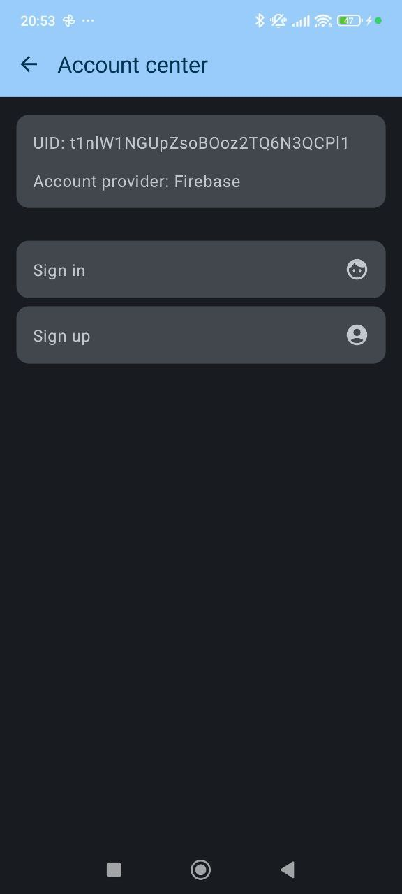

# Házi feladat specifikáció

Információk [itt](https://viauav21.github.io/laborok/hf)

## Androidalapú szoftverfejlesztés
### [Dátum - 2023-24 2. félév]
### [Dancsó Marcell] - ([AZTVS7])
### [dancsomarci@gmail.com] 
### Laborvezető: [Kövesdán Gábor]

## Bemutatás

A feladat jelnyelv fordításhoz adatok gyűjtése. Egy újszerű megközelítés a feladatra, hogy képek/videó helyett, póz approximációval először jellegzetes pontokat azonosítunk be a kézen, majd a modellek ebből tanulnak.
Google MediaPipe Hands modell segítségével ez a lépés elvégezhető android platformon is, majd egy megfelelő backend szolgáltatás össze is gyűjti az adatokat.

## Főbb funkciók

- Felhasználói authentikáció.
- Póz approximációs mesterséges intelligencia modell futtatása a telefonon.
- Utóbbi eredményének megtekintése.
- Póz szekvencia rögzítése, illetve feltöltése.
- Felhasználóhoz tartozó felvételek listázása/törlése.

## Mellékfunkciók

- Anoním fiók és email címes fiók összekapcsolása.
- Bejelentkezett felhasználó adatainak megtekintése.
- Felvétel segítésére mozgatható (draggable) felvétel gomb.
- Bottom navigation bar.

## Választott technológiák

- UI: A felhasználói felület Jetpack Compose-ban és MVI architektúrával
- Firebase
- Firestore
- Animáció
- MI modell futtatása Android környezetben
- Kamerakezelés Jetpack Compose-ban

## Technikai megvalósítás

- Projekt struktúra: feature-first
- DI: Hilt
- Navigáció: Compose Navigation
- Póz felismerés: Mediapipe Hands
- Engedélykezelés: Accompanist plugin
- Kamerakezelés: Compose alapú ImageAnalysis + PreviewView + Fragment alapú saját OverlayView

## Képek:

<table style="width:100%">
  <tr>
    <td></td>
    <td></td>
    <td></td>
    <td></td>
    <td></td>
  </tr>
</table>
